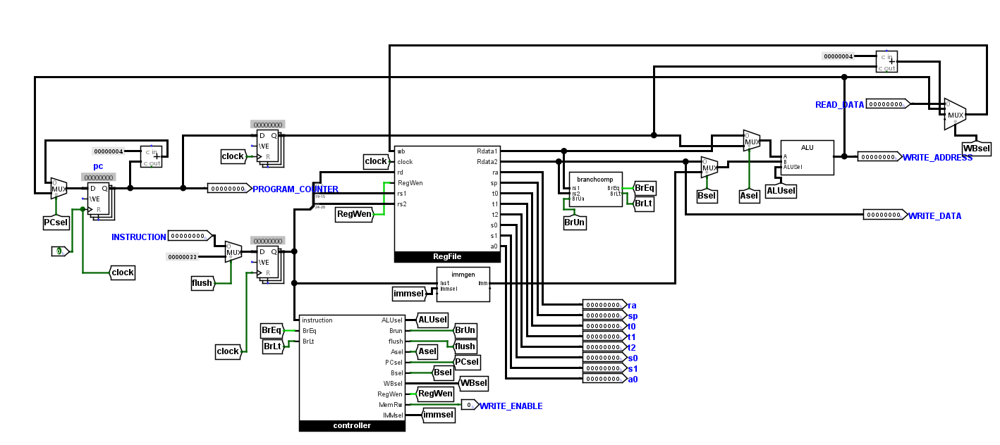
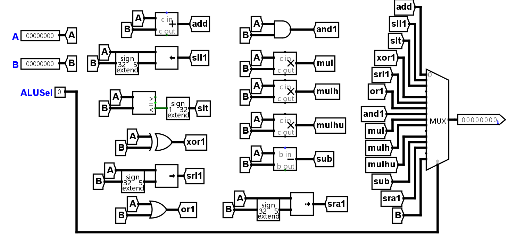
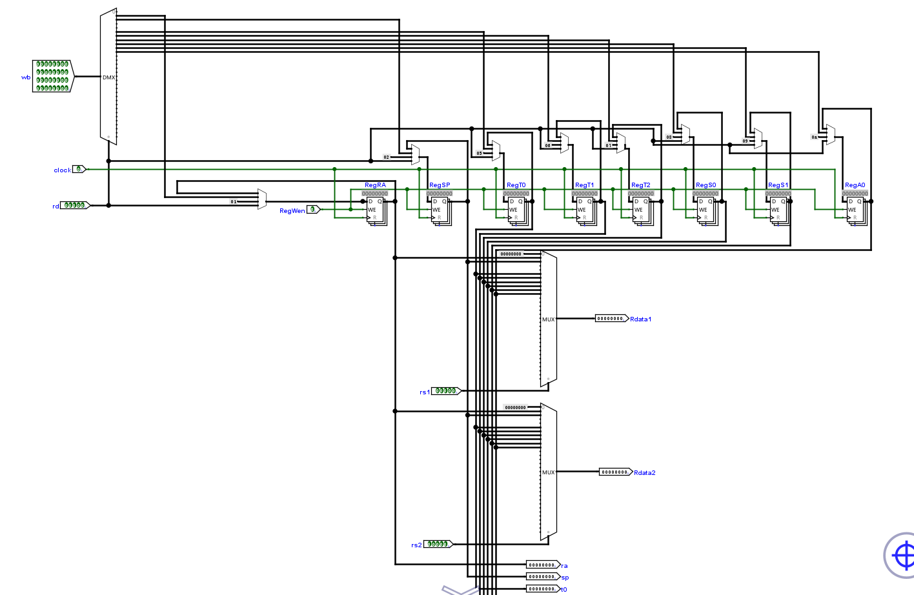
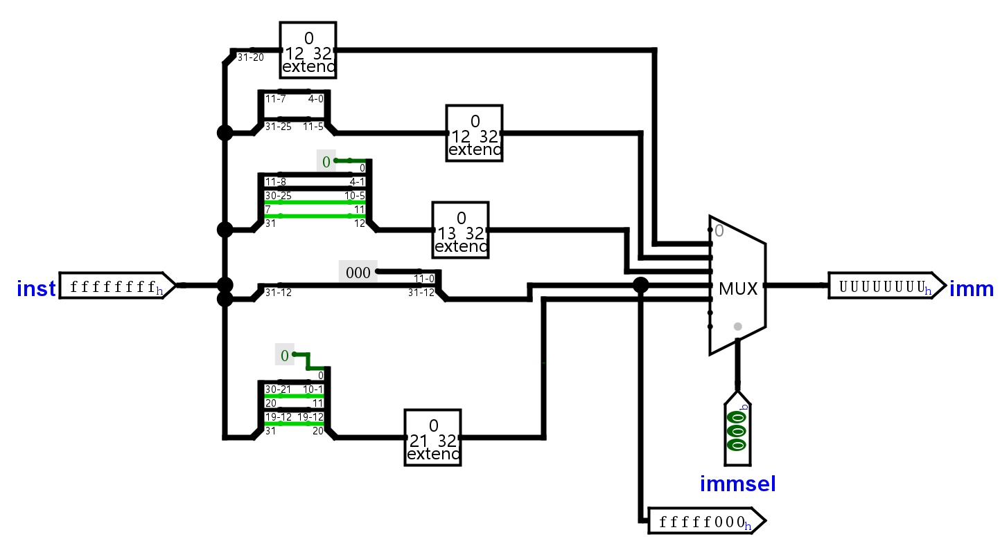
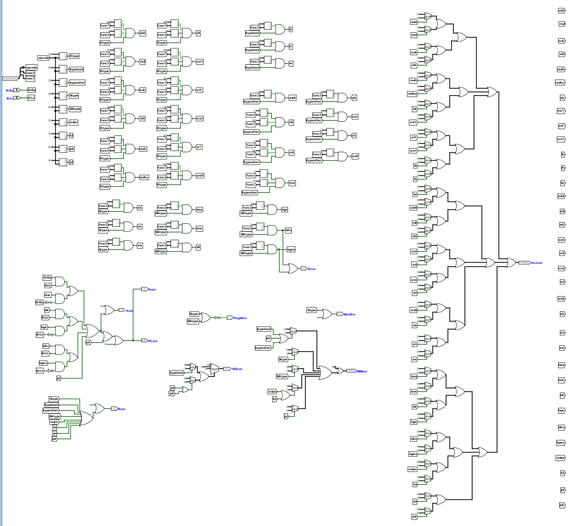

# cpu
This is a 2-stage pipeline risc-v cpu, built on Logisim, which is a educational software for designing and simulating digital logic circuits.
The cpu contains two main parts, the control logic unit and datapath。

# datapath 
The datapath has multiple muxers to select the path for different instructions

## ALU 
A muxer to select the output function unit

## RegFile 
The RegFile has 8 registers. Two muxers select the output register, and a muxer select the writeback register

## immediate generator
Use a muxer to select the output immediate number, splitter and extender can extract the immediate number from instructions

# Controller
Use hard-wired approach to implementing the controller. 
First, divide the instructions to 7 types.
Second, according to the different paths of instructions, select the output bits for different components of the datapath

# pipeline
The datapath is divided into instruction fetch and execute stage. 
For 2-stage pipeline, the only hazard we need to care is control hazard
So we add a flush bit in controller, which will tell the execute nop operation when it's sb and jump instructions
